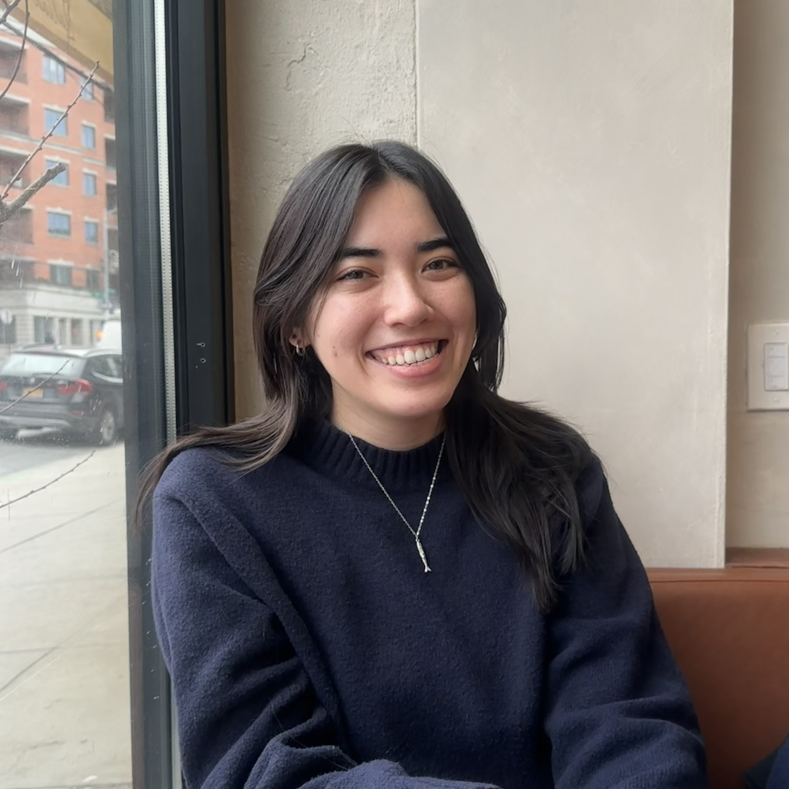

<link rel="stylesheet" href="https://cdnjs.cloudflare.com/ajax/libs/font-awesome/6.5.0/css/all.min.css">

<link href="https://fonts.googleapis.com/css2?family=Inter:wght@300;400;500;600&display=swap" rel="stylesheet">

<nav>

**Kate Colvin**

<a href="#about">About</a>
<a href="#publications">Publications</a>
<a href="#contact">Contact</a>
</nav>

<section id="about" class="hero">

<h2>**Kate Colvin**</h2>

PhD Student, Biostatistics  
[Columbia University](https://www.columbia.edu/)

<a href="KColvin_Resume2026.pdf" class="icon-button" target="_blank">
<i class="fa-solid fa-file-lines"></i>
</a>

<a href="https://scholar.google.com/citations?user=7tNw73oAAAAJ&hl=en" class="icon-button" target="_blank" title="Google Scholar">
<i class="fa-solid fa-graduation-cap"></i>
</a>

<a href="https://github.com/kaaateco" class="icon-button" target="_blank" title="GitHub">
<i class="fa-brands fa-github"></i>
</a>

<a href="https://www.linkedin.com/in/kacolvin/" class="icon-button" target="_blank" title="LinkedIn">
<i class="fa-brands fa-linkedin"></i>
</a>

<h1>About Me</h1>

I am a third-year PhD student in Biostatistics at the Columbia University Mailman School of Public Health.
My current research interests are in clinical trial methodology, causal inference methods, mental health, and cancer.

Before beginning my PhD, I earned bachelor's degrees in Statistics and Public Health from UC Berkeley, where I also led the undergraduate Student Association for Applied Statistics (SAAS). 

I have previously been part of research at the Environmental Health Sciences Division at UC Berkeley, the Plastic and Reconstructive Surgery Service at Memorial Sloan Kettering Cancer Center, and the Department of Biostatistics at University of Michigan. 

</section>

<section id="research">

<h2>Research Interests</h2>

<ul>
<li>Clinical Trial Methodology</li>
<li>Causal Inference Methods</li>
<li>Mental Health</li>
<li>Cancer</li>
</ul>

<h2>Education</h2>

<h3>Columbia University</h3>

PhD in Biostatistics 
2024–Present

<h3>University of California, Berkeley</h3>

BA Statistics, BA Public Health 
2020–2024

</section>

<section id="publications">

<h2>Publications</h2>

S.K. Camponuri, J.R. Head, P.A. Collender, A.K. Weaver, A.K. Heaney, **K.A. Colvin**, A. Bhattachan, G. Sondermeyer-
Cooksey, D. Vugia, S. Jain, J.V. Remais. “Prolonged coccidioidomycosis transmission seasons in a warming California: a
Markov state transition model of shifting disease dynamics.” *Journal of the Royal Society Interface*. 2025 Feb 26.
doi.org/10.1098/rsif.2024.0821

M. Kim, B. Ali, F.D. Graziano, **K.A. Colvin**, L.A. Boe, J.A. Nelson, J. Disa. “Ideal Mastectomy to Free Flap Weight Ratio for
Immediate Autologous Breast Reconstruction.” *Journal of Surgical Oncology.* 2024 Apr 18. doi.org/10.1002/jso.27647

J.R. Head, S.K. Camponuri, A.K. Weaver, L. Montoya, E. Lee, M. Radosevich, I. Jones, R. Wagner, A. Bhattachan, G.
Campbell, N. Keeney, P.A. Collender, A.K. Heaney, **K.A. Colvin**, W.T. Bean, J. Taylor, and J.V. Remais. “Small mammals
and their burrows shape the distribution of Coccidioides in soils: evidence from a long-term ecological experiment in
the Carrizo Plain National Monument, California, USA.” *[submitted]*

</section>

<section id="contact">

<h2>Contact</h2>

[Department of Biostatistics](https://www.publichealth.columbia.edu/academics/departments/biostatistics) 
[Columbia University Mailman School of Public Health](https://www.publichealth.columbia.edu/)  
722 West 168th Street 
New York, New York 10032 

Email:
<a href="mailto:kac2301@cumc.columbia.edu">
kac2301@cumc.columbia.edu
</a>

</section>

